## 1 Abstract

Los agentes biocidas con compuestos usados ampliamente para esterilizar y desinfectar. Sin embargo, una mala aplicación de los mismos en material quirúrjico o médico podría dar lugar a la aparición de resistencias en bacterias. En este estudio, emplean microarrays de ADN para tratar de elucidar si tras la aplicación de concentraciones subinhibitorias de diferentes biocidas, el transcriptoma de la cepa uropatogénica de Escherichia coli CFT073 sufre cambios que pudieran dar lugar a la aparición de dichas resistencias. 


#### 1.1 Key Words

*Biocidas, Persistencia, Resistencia, Escherichia coli*

## 2 Objetivos

El principal objetivo de este trabajo es reanalizar los datos provenientes del estudio **Comparison of gene expression profiles of uropathogenic Escherichia coli CFT073 after prolonged exposure to subinhibitory concentrations of different biocides**, que se encuentran recogidos en la base de datos GEO bajo el número de acceso [GSE135556](https://www.ncbi.nlm.nih.gov/geo/query/acc.cgi?acc=GSE135556). Principalmente, se trata de responder a la pregunta de si concentraciones subinhibitorias de biocidas aplicados sobre cepas uropatogénicas de Escherichia coli pueden desencadenar cambios a nivel transcripcional que sean precursores de la aparición de resistencias. 


## 3 Materiales y Métodos

Para realizar el reanálisis correspondiente, se empleó el software estadístico R (versión 3.6.3) con los siguientes paquetes descargados a través de los repositorios Bioconductor y CRAN:

* GEOquery
* oligo
* Biobase
* ggplot2
* ggrepel
* arrayQualityMetrics
* limma
* genefilter
* ecoli2.db
* clusterProfiler

Asimismo, los datos de los que se disponía poseían las siguientes características:

* **Número de muestras:** 15
* **Número de grupos: 5** (por triplicado)
   * Grupo control 
   * Grupo tratado con Cloruro de Benzalconio
   * Grupo tratado con Clorhexidina
   * Grupo tratado con Peróxido de Hidrógeno
   * Grupo tratado con Triclosan
* **Número de genes/celdas:** 10112
* **Lugar del estudio:** Lyngby (Dinamarca)
* **Plataforma microarray:** Affymetrix E. coli Genome 2.0 Array (GPL3154)

El procedimiento de análisis consistió en las siguientes etapas:

* **Creación del espacio de trabajo**
   * Generación de la estructura de ficheros y las carpetas necesarias para el análisis
* **Descarga de datos, identificación de grupos y asignación de muestras**
   * Descarga de los ficheros .CEL provenientes de la base de datos GEO, se descomprimieron, y se generó el fichero *targets.csv* con los metadatos correspondientes a cada una de las muestras
* **Control de calidad de los datos**
   * Realización de control de calidad de los datos rutinario empleando el paquete . Principalmente, se analiza la fluorescencia de fondo del microarray y se comprueba si existen diferencias significantivas entre las réplicas. En caso de haberlas, es necesario normalizar para asegurar que los cambios que observamos son debidos a cambios biológicos y no a fluctuaciones en la propia técnica.
* **Normalización de los datos**
   * Normalización los valores de fluorescencia absolutos en función de los valores de fluorescencia de fondo
* **Identificación de genes diferencialmente expresados**
   * Realización test de significancia estadística para comprobar qué genes poseen unos niveles de expresión por encima de lo esperado. 
* **Anotación de los resultados**
   * En esta etapa se asignan los diferentes identificadores de las celdas del microarray con los genes correspondientes en diferentes bases de datos a fin de poder realizar análisis más exhaustivos. 
* **Comparación entre distintas condiciones**
   * En este caso, se comprueban qué genes son los que se encuentran diferencialmente expresados en cada condición. 
* **Análisis de significación biológica**
   * Finalmente, se realizan análisis de enriquecimiento para comprobar qué rutas biológicas se encuentran asociadas a los cambios transcripcionales. 

A continuación, se representa de forma gráfica el pipeline ejecutado y se detallan los paquetes o comandos empleados en cada etapa del proceso


{width=250px}

Todos los pasos y comandos ejecutados se encuentran en la sección Apéndice, desde donde se pueden ejecutar de forma reproducible desde el archivo *.Rmd*

## 4 Resultados

#### 4.1 Normalización de los datos y control de calidad

Como hemos resaltado anteriormente, el primer paso de la metodología consiste en una comprobación de la calidad de los datos antes y después de la normalización. A continuación se muestra un gráfico *boxplot* que muestra la distribución de las intensidades en todas las muestras, de modo que gráficamente se puede comprobar si son comparables entre sí . Las órdenes ejecutadas para la obtención de los gráficos puede consultarse en el Apéndice. Como vemos, tras la normalización, las distribuciones se asemejan entre sí y se tornan comparables, cosa que no ocurría antes de normalizar, pues la propia variabilidad técnica del proceso induce cambios en los valores globales de fluorescencia que no han de ser considerados. El proceso de normalización tiene en cuenta la fluorescencia de fondo del microarray para ajustar de forma relativa los valores de fluorescencia de la propia muestra. 


<center>
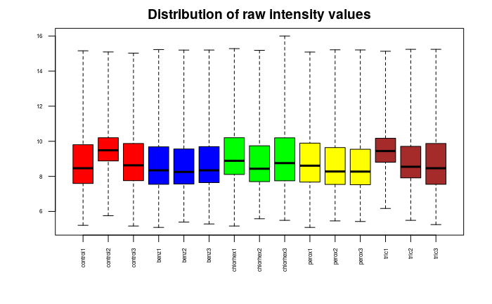{width=49%} 
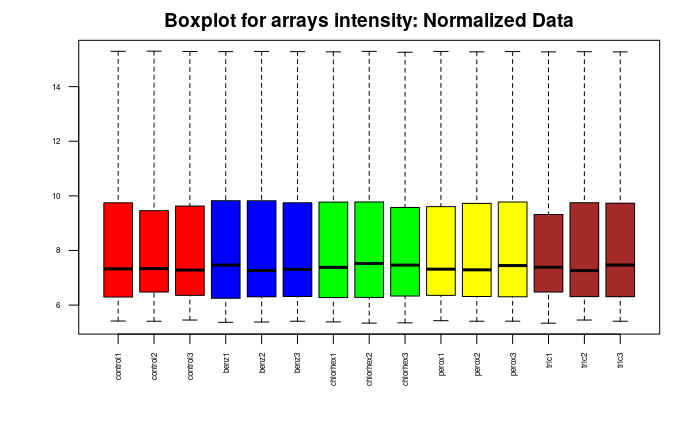{width=49%}
</center>

\begin{center}
Figura 2. Comparación de las distribuciones de intensidades antes y después de normalizar
\end{center}

<p>&nbsp;</p>

Además del *boxplot*, también podemos realizar un análisis *PCA* para comprobar la variabilidad de las muestras. Sin embargo, en nuestro caso el análisis no es muy esclarecedor y apenas aporta información sobre el proceso de normalización: 

<center>
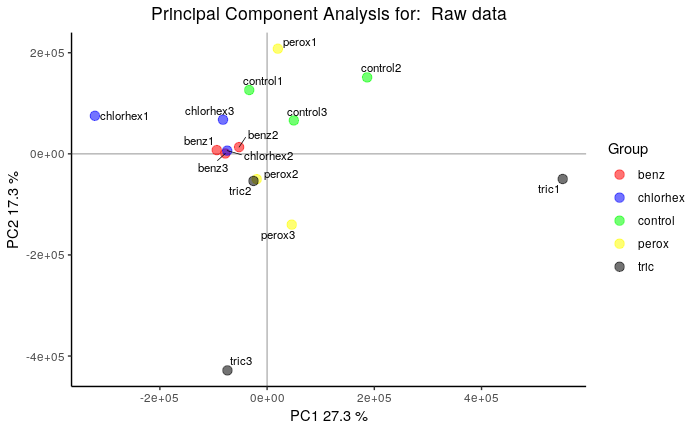{width=49%} 
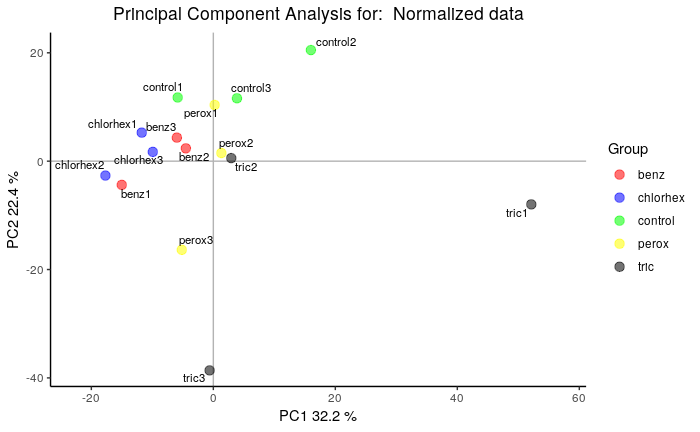{width=49%}
</center>

\begin{center}
Figura 3. Análisis de los componentes principales antes y después de normalizar
\end{center}


#### 4.2 Genes diferencialmente expresados

Si un gen se expresa de manera diferencial, se espera que haya cierta diferencia entre los grupos y, por lo tanto, la varianza global del gen será mayor que la de los que no tienen expresión diferencial. El trazado de la variabilidad global de todos los genes es útil para decidir qué porcentaje de los genes muestra una variabilidad que puede atribuirse a causas distintas de la variación aleatoria. La figura siguiente muestra las desviaciones estándar de todos los genes ordenados de menor a mayor valor. La gráfica muestra que los genes más variables son aquellos con una desviación estándar superior al 90-95% de todas las desviaciones estándar.


<center>
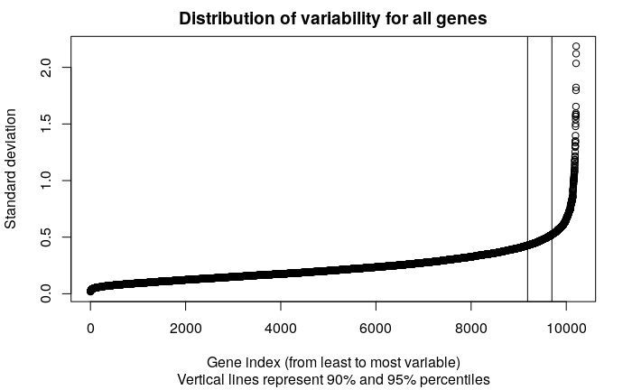 
</center>

\begin{center}
Figura 4. Desviaciones estándar de todos los genes ordenados de menor a mayor valor 
\end{center}

Si analizamos en más detalle los genes diferencialmente expresados en cada condición, podemos esclarecer cuáles son aquellas que suponen una mayor perturbación a nivel transcripcional para la célula, y que de este modo pueden desembocar en la aparición de persistencias y resistencias a agentes biocidas.  
<p>&nbsp;</p>

<center>
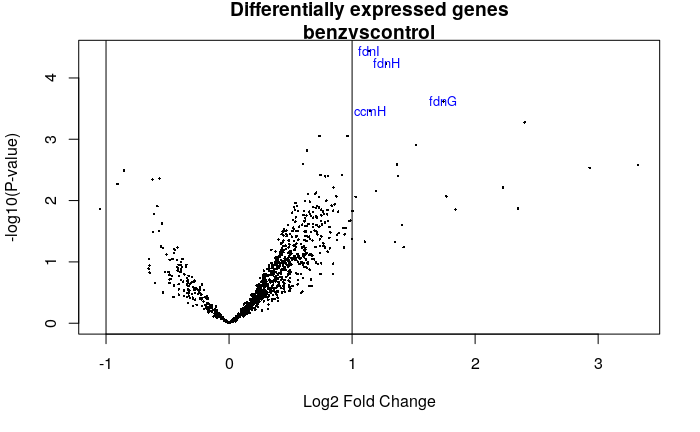{width=49%} 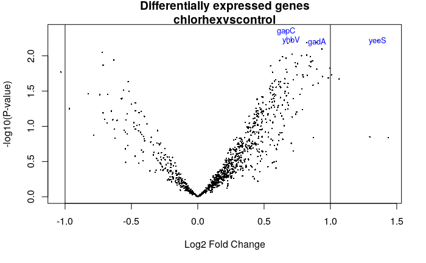{width=49%}
</center>
\begin{center}
Figura 5. Volcano plot de las condiciones Cloruro de Benzalconio vs Control (izq) y Clorhexidina vs Control (dcha)
\end{center}

En el caso del Cloruro de Benzalconio, vemos cómo se genera una respuesta transcripcional significativa que no se ve reflejada en el caso de la Clorhexidina, cuya aplicación apenas produce cambios transcripcionales significativos. 

<p>&nbsp;</p>
<center>
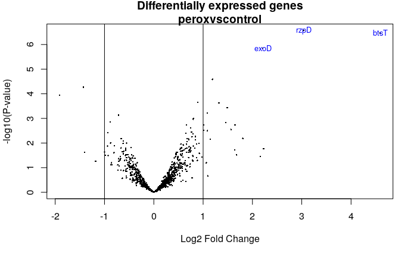{width=49%} 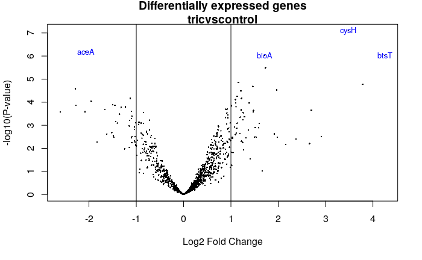{width=49%}
</center>

\begin{center}
Figura 6. Volcano plot de las condiciones Peróxido de Hidrógeno vs Control (izq) y Triclosan vs Control (dcha)
\end{center}

En el caso del Peróxido de Hidrógeno y el Triclosán también vemos cómo se genera una respuesta transcripcional significativa, siendo en el caso del Triclosán bastante acentuada. Si realizamos un diagrama de Venn para ver si los genes diferencialmente expresados (ver figura a continuación) son comunes en las condiciones, podemos ver que en el caso del Peróxido de Hidrógeno y el Triclosán se comparten 5 genes diferencialmente expresados. 

<center>
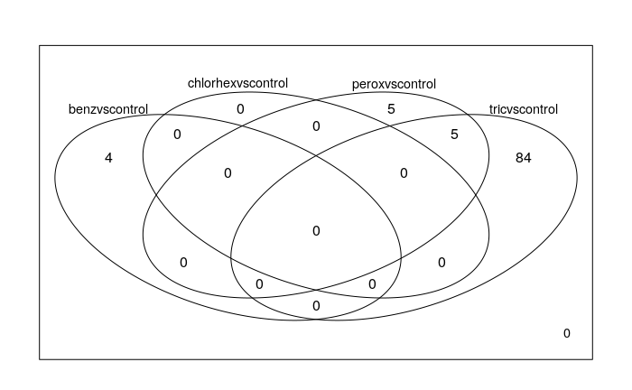
</center>
\begin{center}
Figura 7. Diagrama de Venn con el solapamiento de genes diferencialmente expresados en cada condición
\end{center}

Del mismo modo, también podemos realizar un heatmap con genes seleccionados entre los que muestran mayor significación estadística y ordenarlos en función de un clústering jerárquico mediante dendrogramas. Como vemos, en este caso ocurre algo que ya adelantaban los resultados anteriores, las respuestas transcriptómicas de las bacterias tratadas con Triclosán y Peróxido de Hidrógeno se parecen bastante entre sí, mientras que el resto de condiciones no lo hace tanto.  


<center>
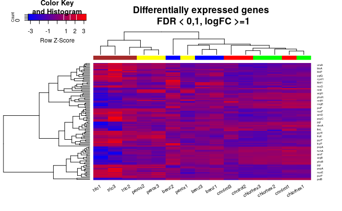
</center>
\begin{center}
Figura 8. Heatmap con los genes seleccionados y dendrograma que muestra su ordenamiento según los patrones de expresión
\end{center}


#### 4.3 Rutas biológicas alteradas

Tras realizar la anotación de los genes diferencialmente expresados y unos análisis previos, procedemos a comprobar en qué rutas biológicas o localizaciones se encuentran involucrados los genes expresados de forma diferencial. Si bien observamos ciertas diferencias entre las muestras, todas ellas (a excepción de la clorhexidina, que parece no generar cambios significativos) parecen estar indicando una respuesta generalizada frente a un mismo tipo de estrés. 

Como vemos en los siguientes gráficos, los genes pueden agruparse según su ontología para dar cuenta de en qué procesos biológicos están involucrados o en qué componentes celulares se encuentran. 

<center>
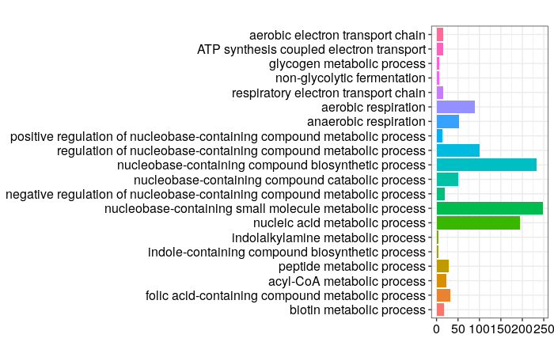{width=49%} 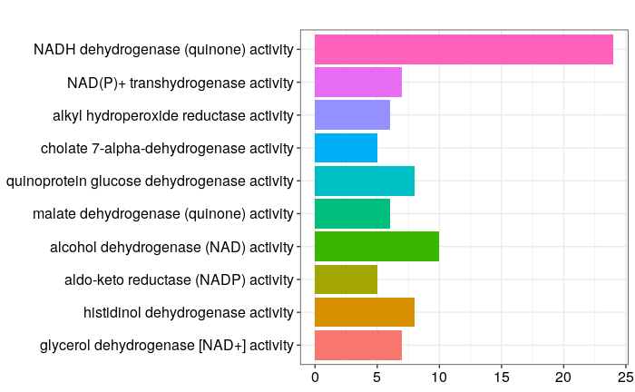{width=49%}
</center>
\begin{center}
Figura 9. Barplots que muestran los procesos biológicos (izquierda) y funciones moleculares (derecha) enriquecidas en las muestras con Triclosán
\end{center}

En el caso del Tricolsán, vemos como la mayoría de procesos enriquecidos están relacionados con procesos metabólicos que involucran nucleobases, mientras que las funciones moleculares están relacionadas con actividades deshidrogenasas y reductasa. 

<center>
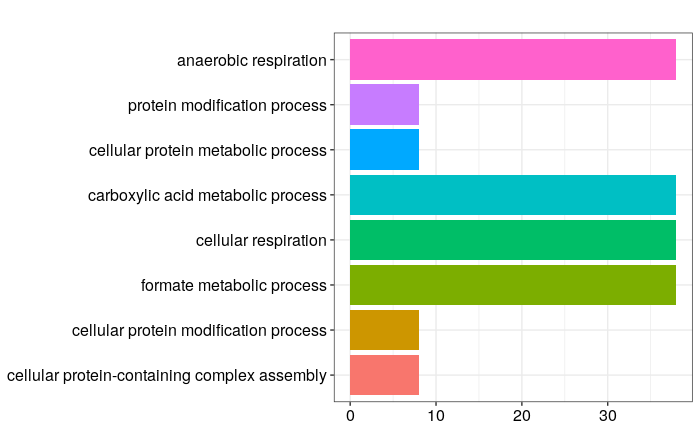{width=49%} 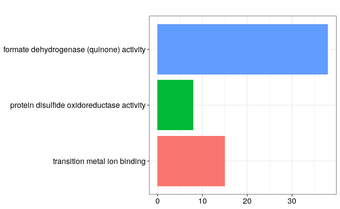{width=49%}
</center>
\begin{center}
Figura 10. Barplots que muestran los procesos biológicos (izquierda) y funciones moleculares (derecha) enriquecidas en las muestras con Cloruro de Benzalconio
\end{center}

En el caso del Cloruro de Benzalconio, vemos como la mayoría de procesos enriquecidos están relacionados con procesos metabólicos relacionados con la respiración, mientras que las funciones moleculares están relacionadas con actividades oxidoreductasas. 

<center>
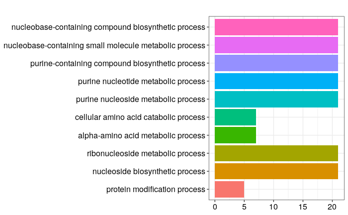{width=49%} 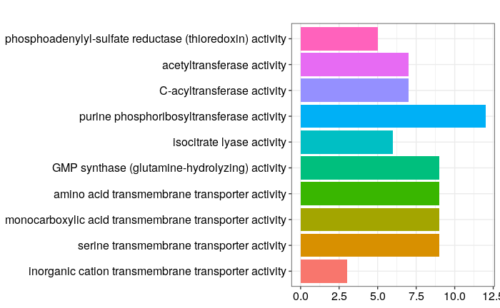{width=49%}</center>
\begin{center}
Figura 11. Barplots que muestran los procesos biológicos (izquierda) y funciones moleculares (derecha) enriquecidas en las muestras con Peróxido de Hidrógeno
\end{center}

En el caso del Peróxido de Hidrógeno, vemos como la mayoría de procesos enriquecidos están relacionados con procesos metabólicos relacionados con la respiración, mientras que las funciones moleculares están relacionadas con actividades oxidoreductasas.

<center>
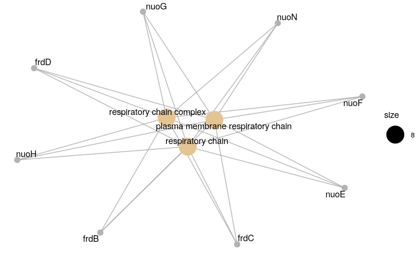
</center>
\begin{center}
Figura 12. Red de coexpresión de genes y componentes celulares enriquecidos
\end{center}

Por último, a modo de muestra, la red de coexpresión de los genes en las muestras tratadas con Triclosán muestra un enriquecimiento en los componentes celulares relacionados con la membrana plasmática y la cadena respiratoria. 

## 5 Discusión

En este caso, vemos como las diferentes condiciones ensayadan muestran una respuesta unitaria frente a los distintos estreses inducidos sobre las células bacterianas: cambios en el metabolismo y en la membrana. Muchos procesos tóxicos que afectan a las enterobacterias atacan a sus esctructuras externas de defensa como la membrana o la pared celular o inducen estrés oxidativo por encima del límite asumible por las células. De este modo, con aplicaciones subletales, una respuesta transcripcional que desemboque en cambios en el metabolismo (especialmente la respiración) y de detoxificación pueden proveer de una defensa frente a dichos ataques externos. Además, un gran número de transportadores necesarios para la detoxificación y la regulación de la homeostasis intracelular se encuentran en la membrana. 

También observamos cambios metabólicos en el citosol, lo que es consistente con una defensa frente a estreses oxidativos inducidos por especies tan reactivas como las que se han empleado en este estudio. 


## 6 Apéndice

Pasos previos: configuración e instalación de paquetes necesarios

Carga de paquetes

```{r echo = T, results = 'hide',message=FALSE,warning=FALSE,fig.show='hide'}
library(GEOquery)
library(oligo)
library(Biobase)
library(ggplot2)
library(ggrepel)
library(arrayQualityMetrics)
library(limma)
library(genefilter)
library(ecoli2.db)
library(clusterProfiler)
```

Creación del espacio de trabajo
```{r echo = T, results = 'hide',message=FALSE,warning=FALSE,fig.show='hide',cache=TRUE}
setwd("/home/mario/Documents/PEC1_omics")
dir.create("data")
dir.create("results")
setwd('./data')
```

Descarga de datos, identificación de grupos y asignación de muestras
```{r echo = T, results = 'hide',message=FALSE,warning=FALSE,fig.show='hide',cache=TRUE}
gse <- getGEO("GSE135556", GSEMatrix =TRUE, getGPL=FALSE)
targets <- pData(gse[[1]])
data <- as.data.frame(exprs(gse[[1]]))
targets <- read.csv2("./data/targets.csv", header = TRUE, sep = ";") 
celFiles <- list.celfiles("./data", full.names = TRUE)
my.targets <-read.AnnotatedDataFrame(file.path("./data","targets.csv"), 
                                      header = TRUE, row.names = 1, 
                                    sep=";") 
rawData <- read.celfiles(celFiles, phenoData = my.targets)
my.targets@data$ShortName->rownames(pData(rawData))
colnames(rawData) <-rownames(pData(rawData)) 
head(rawData)
```

Control de calidad de los datos crudos
```{r echo = T, results = 'hide',message=FALSE,warning=FALSE,fig.show='hide',cache=TRUE}
arrayQualityMetrics(rawData,force = TRUE)

plotPCA3 <- function (datos, labels, factor, title, scale,colores, size = 1.5, glineas = 0.25) {
   data <- prcomp(t(datos),scale=scale)
   # plot adjustments
   dataDf <- data.frame(data$x)
   Group <- factor
   loads <- round(data$sdev^2/sum(data$sdev^2)*100,1)
   # main plot
   p1 <- ggplot(dataDf,aes(x=PC1, y=PC2)) +
     theme_classic() +
     geom_hline(yintercept = 0, color = "gray70") +
     geom_vline(xintercept = 0, color = "gray70") +
     geom_point(aes(color = Group), alpha = 0.55, size = 3) +
     coord_cartesian(xlim = c(min(data$x[,1])-5,max(data$x[,1])+5)) +
     scale_fill_discrete(name = "Group")
   # avoiding labels superposition
   p1 + geom_text_repel(aes(y = PC2 + 0.25, label = labels),segment.size = 0.25, size = size) + 
     labs(x = c(paste("PC1",loads[1],"%")),y=c(paste("PC2",loads[2],"%"))) +  
     ggtitle(paste("Principal Component Analysis for: ",title,sep=" "))+ 
     theme(plot.title = element_text(hjust = 0.5)) +
     scale_color_manual(values=colores)
}
plotPCA3(exprs(rawData), labels = targets$ShortName, factor = targets$Group, 
          title="Raw data", scale = FALSE, size = 3, 
          colores = c("red", "blue", "green", "yellow","black","b"))
```
```{r echo = T, results = 'hide',message=FALSE,warning=FALSE,fig.show='hide'}
boxplot(rawData, cex.axis=0.5, las=2,  which="all", 
         col = c(rep("red", 3), rep("blue", 3), rep("green", 3), rep("yellow", 3),rep("brown", 3)),
         main="Distribution of raw intensity values")
```

Normalización de los datos
```{r echo = T, results = 'hide',message=FALSE,warning=FALSE,fig.show='hide',cache=TRUE}
eset_rma <- rma(rawData)
```

Control de calidad de los datos normalizados
```{r echo = T, results = 'hide',message=FALSE,warning=FALSE,fig.show='hide',cache=TRUE}
arrayQualityMetrics(eset_rma, outdir = file.path("./results", "QCDir.Norm"), force=TRUE)
plotPCA3(exprs(eset_rma), labels = targets$ShortName, factor = targets$Group, 
          title="Normalized data", scale = FALSE, size = 3, 
         colores = c("red", "blue", "green", "yellow","black","brown"))
```
```{r echo = T, results = 'hide',message=FALSE,warning=FALSE,fig.show='hide'}
boxplot(eset_rma, cex.axis=0.5, las=2,  which="all", 
         col = c(rep("red", 3), rep("blue", 3), rep("green", 3), rep("yellow", 3), rep("brown", 3)),
         main="Boxplot for arrays intensity: Normalized Data")
```

Identificación de genes diferencialmente expresados
```{r echo = T, results = 'hide',message=FALSE,warning=FALSE,fig.show='hide',cache=TRUE}
sds <- apply (exprs(eset_rma), 1, sd)
sdsO<- sort(sds)
plot(1:length(sdsO), sdsO, main="Distribution of variability for all genes",
      sub="Vertical lines represent 90% and 95% percentiles",
      xlab="Gene index (from least to most variable)", ylab="Standard deviation")
abline(v=length(sds)*c(0.9,0.95))
```

Anotación de los resultados
```{r echo = T, results = 'hide',message=FALSE,warning=FALSE,fig.show='hide',cache=TRUE}
annotation(eset_rma) <- "ecoli2.db"
filtered <- nsFilter(eset_rma, 
                    require.entrez = TRUE, remove.dupEntrez = TRUE,
                    var.filter=TRUE, var.func=IQR, var.cutoff=0.75, 
                    filterByQuantile=TRUE, feature.exclude = "^AFFX")
print(filtered$filter.log)
eset_filtered <-filtered$eset
```

Guardar ficheros anotados
```{r echo = T, results = 'hide',message=FALSE,warning=FALSE,fig.show='hide',cache=TRUE}
write.csv(exprs(eset_rma), file="./results/normalized.Data.csv")
write.csv(exprs(eset_filtered), file="./results/normalized.Filtered.Data.csv")
save(eset_rma, eset_filtered, file="./results/normalized.Data.Rda")
```

Comparaciones
```{r echo = T, results = 'hide',message=FALSE,warning=FALSE,fig.show='hide',cache=TRUE}
if (!exists("eset_filtered")) load (file="./results/normalized.Data.Rda")
designMat<- model.matrix(~0+Group, pData(eset_filtered))
colnames(designMat) <- c("benz", "chlorhex", "control", "perox","tric")
print(designMat)
```

```{r echo = T, results = 'hide',message=FALSE,warning=FALSE,fig.show='hide',cache=TRUE}
cont.matrix <- makeContrasts (benzvscontrol = benz-control,
                              chlorhexvscontrol = chlorhex-control,
                              peroxvscontrol = perox-control,
                              tricvscontrol = tric-control,
                              levels=designMat)
```

```{r echo = T, results = 'hide',message=FALSE,warning=FALSE,fig.show='hide',cache=TRUE}
library(limma)
fit<-lmFit(eset_filtered, designMat)
fit.main<-contrasts.fit(fit, cont.matrix)
fit.main<-eBayes(fit.main)
class(fit.main)
```
```{r echo = T, results = 'hide',message=FALSE,warning=FALSE,fig.show='hide',cache=TRUE}
benzvscontrol <- topTable (fit.main, number=nrow(fit.main), coef="benzvscontrol", adjust="fdr") 
chlorhexvscontrol <- topTable (fit.main, number=nrow(fit.main), coef="chlorhexvscontrol", adjust="fdr") 
peroxvscontrol <- topTable (fit.main, number=nrow(fit.main), coef="peroxvscontrol", adjust="fdr") 
tricvscontrol <- topTable (fit.main, number=nrow(fit.main), coef="tricvscontrol", adjust="fdr") 
```

```{r echo = T, results = 'hide',message=FALSE,warning=FALSE,fig.show='hide',cache=TRUE}
topTab_benzvscontrol <- topTable (fit.main, number=nrow(fit.main), coef="benzvscontrol", adjust="fdr") 
topTab_chlorhexvscontrol <- topTable (fit.main, number=nrow(fit.main), coef="chlorhexvscontrol", adjust="fdr") 
topTab_peroxvscontrol <- topTable (fit.main, number=nrow(fit.main), coef="peroxvscontrol", adjust="fdr") 
topTab_tricvscontrol <- topTable (fit.main, number=nrow(fit.main), coef="tricvscontrol", adjust="fdr") 
```


```{r echo = T, results = 'hide',message=FALSE,warning=FALSE,fig.show='hide',cache=TRUE}
annotatedTopTable <- function(topTab, anotPackage)
{
 topTab <- cbind(PROBEID=rownames(topTab), topTab)
 myProbes <- rownames(topTab)
 thePackage <- eval(parse(text = anotPackage))
 geneAnots <- select(thePackage, myProbes, c("SYMBOL", "ENTREZID", "GENENAME"))
 annotatedTopTab<- merge(x=geneAnots, y=topTab, by.x="PROBEID", by.y="PROBEID")
return(annotatedTopTab)
}
```

```{r echo = T, results = 'hide',message=FALSE,warning=FALSE,fig.show='hide',cache=TRUE}
topAnnotated_benzvscontrol <- annotatedTopTable(topTab_benzvscontrol,
anotPackage="ecoli2.db")
topAnnotated_chlorhexvscontrol <- annotatedTopTable(topTab_chlorhexvscontrol,
anotPackage="ecoli2.db")
topAnnotated_peroxvscontrol <- annotatedTopTable(topTab_peroxvscontrol,
anotPackage="ecoli2.db")
topAnnotated_tricvscontrol <- annotatedTopTable(topTab_tricvscontrol,
anotPackage="ecoli2.db")

write.csv(topAnnotated_benzvscontrol, file="./results/topAnnotated_benzvscontrol")
write.csv(topAnnotated_chlorhexvscontrol, file="./results/topAnnotated_chlorhexvscontrol")
write.csv(topAnnotated_peroxvscontrol, file="./results/topAnnotated_peroxvscontrol")
write.csv(topAnnotated_tricvscontrol, file="./results/topAnnotated_tricvscontrol")
```

Comparación entre distintas condiciones 

```{r echo = T, results = 'hide',message=FALSE,warning=FALSE,fig.show='hide',cache=TRUE}
geneSymbols <- select(ecoli2.db, rownames(fit.main), c("SYMBOL"))
SYMBOLS<- geneSymbols$SYMBOL
volcanoplot(fit.main, coef=1, highlight=4, names=SYMBOLS, 
           main=paste("Differentially expressed genes", colnames(cont.matrix)[1], sep="\n"))
abline(v=c(-1,1))
```
```{r echo = T, results = 'hide',message=FALSE,warning=FALSE,fig.show='hide',cache=TRUE}
geneSymbols <- select(ecoli2.db, rownames(fit.main), c("SYMBOL"))
SYMBOLS<- geneSymbols$SYMBOL
volcanoplot(fit.main, coef=2, highlight=4, names=SYMBOLS, 
           main=paste("Differentially expressed genes", colnames(cont.matrix)[2], sep="\n"))
abline(v=c(-1,1))
```

```{r echo = T, results = 'hide',message=FALSE,warning=FALSE,fig.show='hide',cache=TRUE}
geneSymbols <- select(ecoli2.db, rownames(fit.main), c("SYMBOL"))
SYMBOLS<- geneSymbols$SYMBOL
volcanoplot(fit.main, coef=3, highlight=3, names=SYMBOLS, 
           main=paste("Differentially expressed genes", colnames(cont.matrix)[3], sep="\n"))
abline(v=c(-1,1))
```

```{r echo = T, results = 'hide',message=FALSE,warning=FALSE,fig.show='hide',cache=TRUE}
geneSymbols <- select(ecoli2.db, rownames(fit.main), c("SYMBOL"))
SYMBOLS<- geneSymbols$SYMBOL
volcanoplot(fit.main, coef=4, highlight=4, names=SYMBOLS, 
           main=paste("Differentially expressed genes", colnames(cont.matrix)[4], sep="\n"))
abline(v=c(-1,1))
```

```{r echo = T, results = 'hide',message=FALSE,warning=FALSE,fig.show='hide',cache=TRUE}
res<-decideTests(fit.main, method="separate", adjust.method="fdr", p.value=0.1, lfc=1)
sum.res.rows<-apply(abs(res),1,sum)
res.selected<-res[sum.res.rows!=0,] 
print(summary(res))
```

```{r echo = T, results = 'hide',message=FALSE,warning=FALSE,fig.show='hide',cache=TRUE}
vennDiagram (res.selected[,1:4], cex=0.9)
```

```{r echo = T, results = 'hide',message=FALSE,warning=FALSE,fig.show='hide',cache=TRUE}
probesInHeatmap <- rownames(res.selected)
HMdata <- exprs(eset_filtered)[rownames(exprs(eset_filtered)) %in% probesInHeatmap,]
geneSymbols <- select(ecoli2.db, rownames(HMdata), c("SYMBOL"))
SYMBOLS<- geneSymbols$SYMBOL
rownames(HMdata) <- SYMBOLS
write.csv(HMdata, file = file.path("./results/data4Heatmap.csv"))
```

```{r echo = T, results = 'hide',message=FALSE,warning=FALSE,fig.show='hide',cache=TRUE}
my_palette <- colorRampPalette(c("blue", "red"))(n = 299)
library(gplots)

heatmap.2(HMdata,
           Rowv = FALSE,
           Colv = FALSE,
           main = "Differentially expressed genes \n FDR < 0,1, logFC >=1",
           scale = "row",
           col = my_palette,
           sepcolor = "white",
           sepwidth = c(0.05,0.05),
           cexRow = 0.5,
           cexCol = 1.2,
           key = TRUE,
           keysize = 1.5,
           density.info = "histogram",
           ColSideColors = c(rep("red",3),rep("blue",3), rep("green",3), rep("yellow",3),rep("brown",3)),
           tracecol = NULL,
           dendrogram = "none",
           srtCol = 30)
```
```{r echo = T, results = 'hide',message=FALSE,warning=FALSE,fig.show='hide',cache=TRUE}
heatmap.2(HMdata,
           Rowv = TRUE,
           Colv = TRUE,
           dendrogram = "both",
           main = "Differentially expressed genes \n FDR < 0,1, logFC >=1",
           scale = "row",
           col = my_palette,
           sepcolor = "white",
           sepwidth = c(0.05,0.05),
           cexRow = 0.5,
           cexCol = 0.9,
           key = TRUE,
           keysize = 1.5,
           density.info = "histogram",
           ColSideColors = c(rep("red",3),rep("blue",3), rep("green",3), rep("yellow",3),rep("brown",3)),
           tracecol = NULL,
           srtCol = 30)
```

```{r echo = T, results = 'hide',message=FALSE,warning=FALSE,fig.show='hide',cache=TRUE}
listOfTables <- list(benzvscontrol = topTab_benzvscontrol, 
                    chlorhexvscontrol  = topTab_chlorhexvscontrol, 
                     peroxvscontrol = topTab_peroxvscontrol,
                    tricvscontrol = topTab_tricvscontrol)
listOfSelected <- list()
for (i in 1:length(listOfTables)){
# select the toptable
topTab <- listOfTables[[i]]
# select the genes to be included in the analysis
whichGenes<-topTab["adj.P.Val"]<0.1
selectedIDs <- rownames(topTab)[whichGenes]
# convert the ID to Entrez
EntrezIDs<- select(ecoli2.db, selectedIDs, c("ENTREZID"))
EntrezIDs <- EntrezIDs$ENTREZID

listOfSelected[[i]] <- EntrezIDs
names(listOfSelected)[i] <- names(listOfTables)[i]
}
sapply(listOfSelected, length)
```

```{r echo = T, results = 'hide',message=FALSE,warning=FALSE,fig.show='hide',cache=TRUE}
mapped_genes2GO <- mappedkeys(org.EcK12.eg.db)
mapped_genes2KEGG <- mappedkeys(org.EcK12.egPATH)
mapped_genes <- union(mapped_genes2GO , mapped_genes2KEGG)
```

```{r echo = T, results = 'hide',message=FALSE,warning=FALSE,fig.show='hide',cache=TRUE}
gene.df <- bitr(listOfSelected$tricvscontrol, fromType = "ENTREZID",
        toType = c("SYMBOL","GO"),
        OrgDb = org.EcK12.eg.db)
ggo <- groupGO(gene = gene.df$ENTREZID ,OrgDb    = org.EcK12.eg.db, ont = "MF",level = 6, readable = TRUE)
barplot(ggo, drop = TRUE, showCategory = 10)
```

```{r echo = T, results = 'hide',message=FALSE,warning=FALSE,fig.show='hide',cache=TRUE}
ego <- enrichGO(gene          = gene.df$ENTREZID,
                universe      = mapped_genes,
                OrgDb         = org.EcK12.eg.db,
                ont           = "CC",
                pvalueCutoff  = 0.2,
        readable      = TRUE)
barplot(ego, showCategory = 3)
cnetplot(ego, categorySize = "pvalue")
```

```{r echo = T, results = 'hide',message=FALSE,warning=FALSE,fig.show='hide',cache=TRUE}
gene.df <- bitr(listOfSelected$benzvscontrol, fromType = "ENTREZID",
        toType = c("SYMBOL","GO"),
        OrgDb = org.EcK12.eg.db)
ggo <- groupGO(gene = gene.df$ENTREZID ,OrgDb    = org.EcK12.eg.db, ont = "MF",level = 6, readable = TRUE)
barplot(ggo, drop = TRUE, showCategory = 40)
```

```{r echo = T, results = 'hide',message=FALSE,warning=FALSE,fig.show='hide',cache=TRUE}
gene.df <- bitr(listOfSelected$peroxvscontrol, fromType = "ENTREZID",
        toType = c("SYMBOL","GO"),
        OrgDb = org.EcK12.eg.db)
ggo <- groupGO(gene = gene.df$ENTREZID ,OrgDb    = org.EcK12.eg.db, ont = "MF",level = 6, readable = TRUE)
barplot(ggo, drop = TRUE, showCategory = 10)
```


